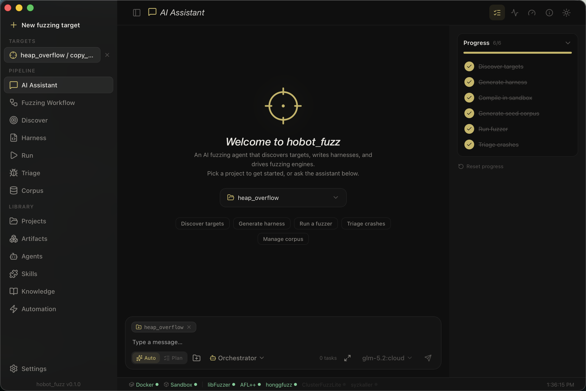
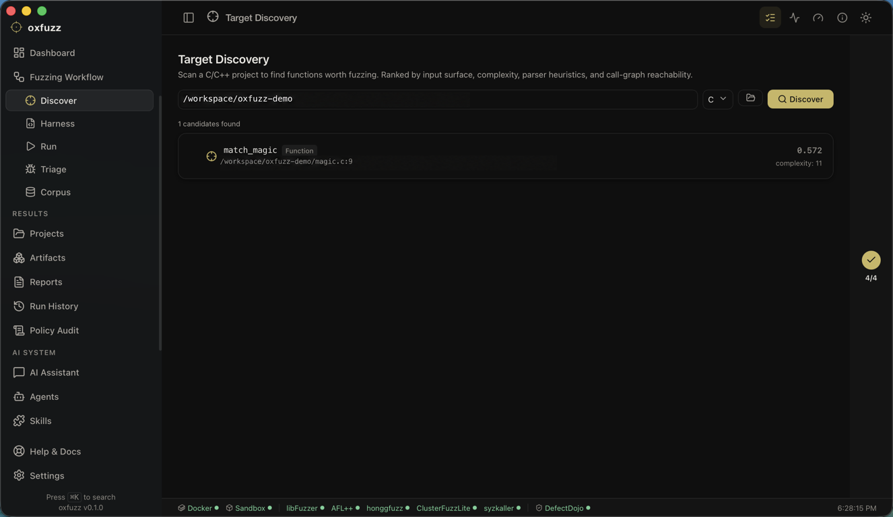
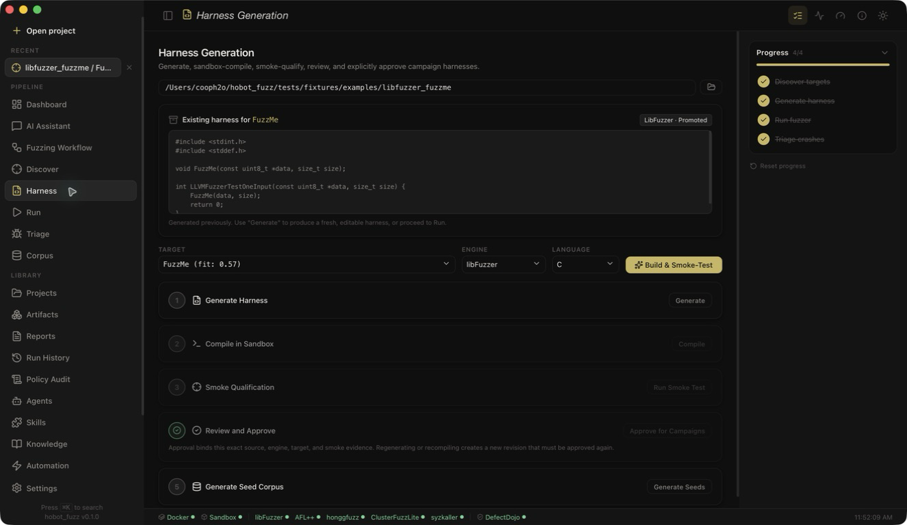
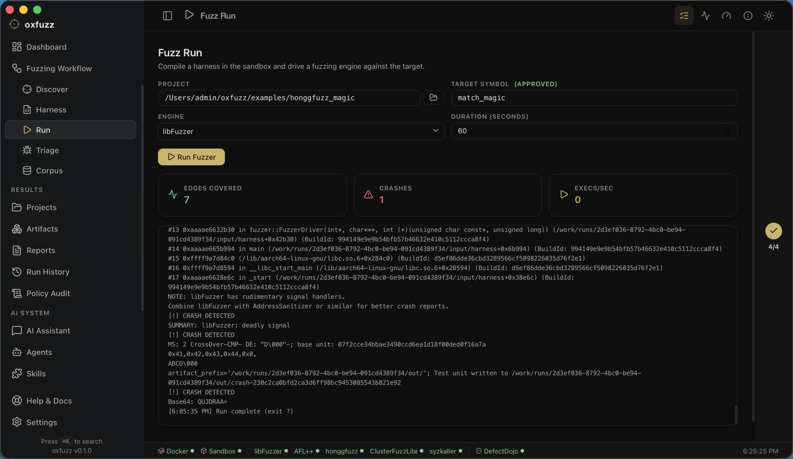
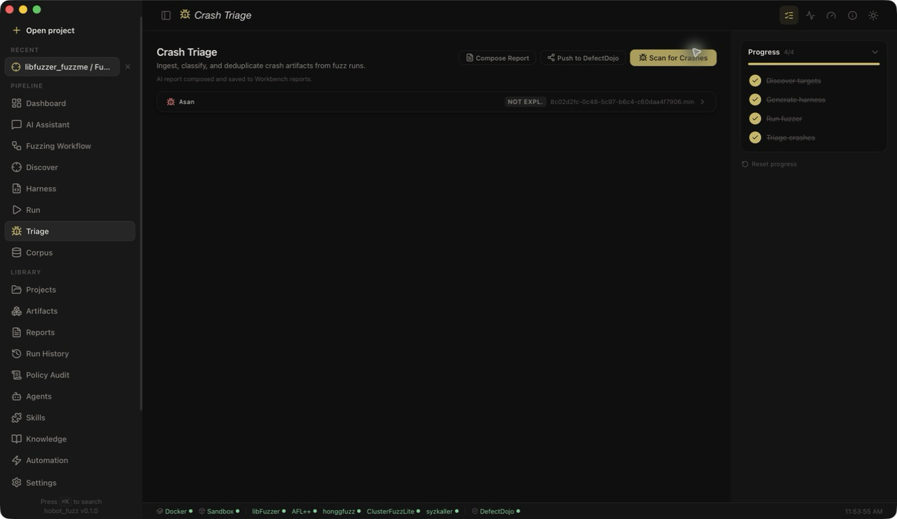
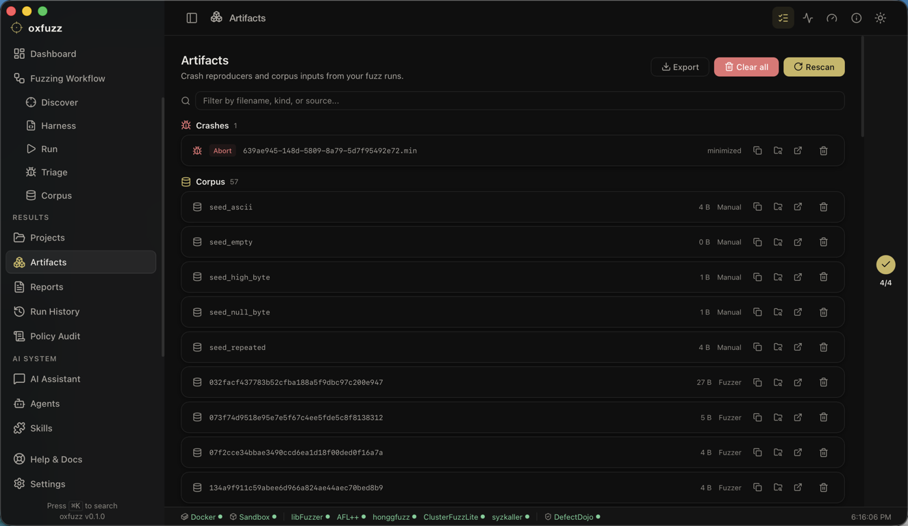
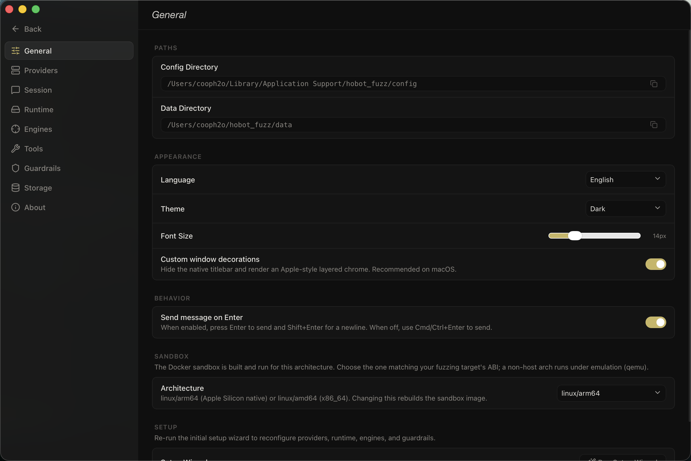
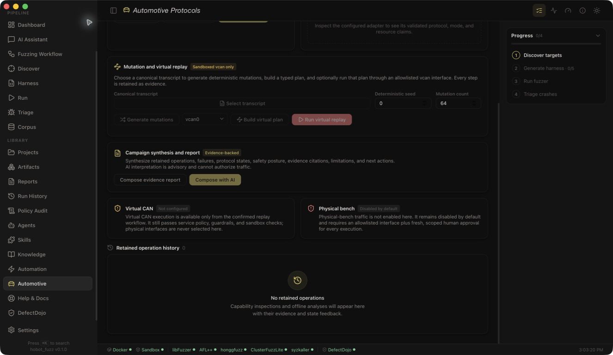

# hobot_fuzz

> An AI fuzzing agent that discovers targets, writes harnesses, drives open-source fuzzing engines, and triages the crashes -- under human-in-the-loop supervision and sandboxed execution.

**Target Discovery** &middot; **Harness Generation** &middot; **Engine Integration** &middot; **Crash Triage** &middot; **Corpus & Coverage Loop** &middot; **Self-Evolving Skills**

<p align="center">
  
</p>

---

## New to fuzzing? Start here

In plain language: **fuzzing** means automatically throwing millions of weird and
malformed inputs at a program to find the ones that make it crash -- each crash
is a potential bug, often a security hole. Doing this by hand takes expert work:
deciding what to test, writing test code, running it safely, and making sense of
the crashes.

**hobot_fuzz coordinates that workflow with AI and deterministic tooling.** You
point it at a codebase and it ranks candidate targets, drafts and qualifies test
harnesses, drives a real fuzzing engine inside a mandatory sandbox, and retains
evidence for the crashes it finds. Human approval is bound to the exact harness
revision that is allowed to enter a full campaign.

If you are not a fuzzing engineer, read the **[Getting Started
guide](docs/guides/GETTING_STARTED.md)** first -- it explains everything from
scratch, walks through your first run in the desktop app, and includes a glossary
of every term. The rest of this README is the technical reference.

---

## Table of Contents

- [New to fuzzing? Start here](#new-to-fuzzing-start-here)
- [Highlights](#highlights)
- [The Desktop App](#the-desktop-app)
- [Install & Build](#install--build)
- [Release Readiness](#release-readiness)
- [Quick Start (CLI)](#quick-start-cli)
- [Command Reference](#command-reference)
- [Configuration Reference](#configuration-reference)
- [Safety Model](#safety-model)
- [Architecture](#architecture)
- [Crate Map](#crate-map)
- [Documentation](#documentation)
- [License](#license)

---

## Highlights

| Capability | Description |
| --- | --- |
| **Operational Dashboard** | Readiness, harness-review state, recent campaigns, crash handoff, and evidence counts in one operator-focused view. |
| **Target Discovery** | Semantic + static-analysis scan of a project producing a ranked Target Inventory (fit score, input surface, complexity, call-graph reachability). |
| **Harness Generation** | LLM-authored, compile-validated, smoke-fuzzed harnesses per target. |
| **Engine Integration** | AFL++, honggfuzz, libFuzzer, ClusterFuzzLite, and Syzkaller behind one `EngineAdapter` trait. |
| **Crash Triage** | Dedup by stack signature, CASR severity/exploitability, minimize, and LLM-drafted bug reports under human review. |
| **Corpus & Coverage** | Seed, grow, prune, and merge corpora; track coverage deltas; feed crashes back into the corpus. |
| **AI Assistant** | A conversational control surface for the same service-owned workflow, with visible tool activity and policy-enforced human approval gates. |
| **Multi-Provider LLM Pool** | Tag-based routing, automatic failover, provider freeze/thaw across OpenAI, Anthropic, Gemini, and OpenAI-compatible backends. |
| **Sandboxed Execution** | Every harness build and fuzz run goes through the mandatory Docker-backed `hf-runtime`; there is no production host-execution fallback. |
| **Scheduled Campaigns** | Headless, budget-bounded fuzzing on an interval/cron/once schedule, rotating through a project's promoted targets. |
| **Issue & Vuln Tracking** | File crashes as GitHub/GitLab issues or push them to DefectDojo as findings; export SARIF for code scanning. |
| **Retained Evidence** | Run history, policy decisions, reports, crash reproducers, corpora, coverage, and exportable project evidence remain available for review. |
| **Desktop, CLI & Web** | A native macOS app (Tauri v2 + React) with a built-in Help guide, a full CLI/TUI, and a REST + SSE API -- all over the same service core. |

---

## The Desktop App

The desktop app (Tauri v2 + React 19) is the primary way to drive hobot_fuzz. It
links the `hf-service` core directly, so the AI Assistant, discovery, fuzzing,
and triage all run locally with the same sandboxing and guardrails as the CLI.

```bash
./scripts/build-app.sh        # builds target/release/bundle/macos/hobot_fuzz.app + .dmg
open target/release/bundle/macos/hobot_fuzz.app
```

On first launch a short setup wizard configures your LLM provider, checks the
sandbox, and points hobot_fuzz at your first project. After that the left
sidebar is your control panel. Pipeline surfaces cover the Dashboard, AI
Assistant, guided workflow, Discover, Harness, Run, Triage, and Corpus. Library
and operations surfaces add Projects, Artifacts, Reports, Run History, Policy
Audit, Agents, Skills, Knowledge, Automation, Automotive, DefectDojo, Help &
Docs, and Settings.

### A campaign, end to end

**0. Confirm readiness and the next operator action.** The Dashboard summarizes
sandbox and engine readiness, retained evidence, harness promotion state,
recent campaigns, and crash handoff. A blocked requirement stays visible
instead of being hidden behind a generic status.

**1. Discover the attack surface.** Point hobot_fuzz at a C/C++ project and it
scans for fuzzable functions, ranking them into a Target Inventory by fit score,
input surface, complexity, and reachability from entry points.



**2. Generate, qualify, and promote a harness.** Pick a target and the agent
drafts a harness, compiles it in the sandbox, runs bounded smoke qualification,
and prepares a seed corpus. You then review and explicitly promote that exact
revision before any full campaign can start. Regeneration invalidates the prior
promotion.



**3. Run the fuzzer.** Launch an enabled engine against the promoted harness.
The Run view shows campaign limits and retained metrics -- executions/sec,
coverage edges, elapsed time, and findings -- with cooperative cancellation for
an active sandboxed run.



**4. Triage the crashes.** Crashes are ingested, deduplicated by stack
signature, minimized, and classified with CASR for severity and exploitability.
The agent can draft a report from retained evidence for human review, and the
result can be exported or handed off to DefectDojo.



**Review retained evidence.** The Artifacts view collects persisted crash
reproducers and corpus inputs across the selected project in one place. Reports,
run history, policy audit, and evidence export provide the wider audit trail.



### Talk to it instead

Everything above is also available conversationally. The **AI Assistant** uses
the same service tools for discovery, harnessing, running, and triage. It can
recommend and prepare work, but it cannot turn a draft into an approved full
campaign by itself. Guardrails, sandbox policy, and the human promotion record
remain authoritative.

### Settings

The Settings panel is the single source of truth for operator configuration:
LLM providers, enabled fuzzing engines, run defaults, sandboxed campaign limits,
storage cleanup, and external integrations. Mandatory sandboxing, blocked
fuzzer networking, and human promotion before full campaigns are displayed as
enforced guarantees rather than switches.



> The GUI also runs in the browser against the REST API for development:
> `cd crates/hf-gui && npm run dev:web` (talks to `hobot-fuzz serve` over HTTP).

---

## Install & Build

### Prerequisites

| Dependency | Required? | Notes |
| --- | --- | --- |
| **Rust 1.94+** | Yes | Pinned in `rust-toolchain.toml` |
| **Node 20.19+ or 22.12+ / npm** | Desktop app | Vite 7 requirement; GitLab CI uses Node 22 |
| **Docker** | Yes | Mandatory boundary for harness builds, fuzz runs, and crash parsing |
| **SQLite 3.35+** | Embedded | Bundled, no action needed |
| **Fuzzing engines** | Bundled | AFL++, honggfuzz, libFuzzer, ClusterFuzzLite, and syzkaller live in the sandbox image |

### The CLI binary

```bash
git clone <your-hobot_fuzz-remote>
cd hobot_fuzz
cargo build --release
# Binary: target/release/hobot-fuzz

# Build and verify the versioned sandbox toolchain.
./scripts/build-sandbox.sh
```

### The desktop app (macOS)

```bash
./scripts/build-app.sh
# App:  target/release/bundle/macos/hobot_fuzz.app
# DMG:  target/release/bundle/dmg/hobot_fuzz_0.1.0_aarch64.dmg
```

### DefectDojo (optional findings dashboard)

hobot_fuzz adopts a local DefectDojo rather than bundling one. `scripts/setup-defectdojo.sh`
(double-click `setup-defectdojo.command`) installs it for you: it clones
DefectDojo's upstream compose project, pulls the released images, starts the
stack on `http://localhost:8080`, and writes `config/defectdojo.toml`. The
environment-setup entry points (`rebuild-sandbox-image.command`,
`scripts/build-app.sh`) run it best-effort and idempotently; set
`HF_SKIP_DEFECTDOJO=1` to skip. Fuzzing never depends on it.

```bash
./scripts/setup-defectdojo.sh        # first run pulls several GB; idempotent thereafter
```

`scripts/health-check.sh` delegates to `hobot-fuzz doctor`, which probes the
Docker daemon, sandbox image, and engine tools inside that image. Host engine
binaries and optional integrations do not determine core readiness.

---

## Release Readiness

A release candidate is ready only when its source gates, sandbox health, CLI
artifact, and platform bundle have all been verified from the same commit. The
repository provides a local gate runner, GitLab CI jobs for locked all-feature
coverage, and release build scripts:

```bash
./scripts/tests/gates.sh
./scripts/build-sandbox.sh
./scripts/build-release.sh
target/release/hobot-fuzz doctor
./scripts/build-app.sh
```

On macOS, `build-app.sh` verifies the `.app` signature and the generated DMG.
Its default ad-hoc signature is suitable for local QA, not public distribution;
a distributed build still needs the organization's Developer ID signing and
notarization workflow. Use the **[release checklist](docs/guides/RELEASE_CHECKLIST.md)**
for the full evidence, packaging, safety, and handoff gates.

---

## Quick Start (CLI)

### 1. Initialize configuration

```bash
hobot-fuzz init
hobot-fuzz doctor
```

This materializes the supported `config/*.example.toml` templates and creates
the database. Environment overrides remain explicit in `.env.example`; `init`
does not create or modify `.env`.

### 2. Configure at least one LLM provider

Copy `config/providers.example.toml` to `config/providers.toml` and fill it in,
then export the matching key in the environment that launches `hobot-fuzz`:

```toml
[[providers]]
id = "openai-main"
provider_type = "openai"
model = "gpt-4o"
tags = ["reasoning", "general"]
api_key_env = "OPENAI_API_KEY"
```

`.env.example` is a variable reference, not an automatically loaded file. If
you keep local values in `.env`, export them before launching the process (for
example, `set -a; source .env; set +a` in a POSIX shell).

### 3. Run a campaign

```bash
# Discover and rank targets in a project
hobot-fuzz discover /path/to/project --lang c --rank

# Generate a harness for a specific target
hobot-fuzz harness /path/to/project --target parse_value --engine afl++ --promote

# Run the fuzzer
hobot-fuzz run /path/to/project --target parse_value --engine afl++ --duration 60m

# Triage the crashes it found
hobot-fuzz triage /path/to/project --target parse_value
```

---

## Command Reference

| Command | What it does |
| --- | --- |
| `init` | Scaffold config from templates and create/migrate the database. |
| `doctor [--json]` | Probe the mandatory Docker sandbox and its bundled engines; exit non-zero when fuzzing is not ready. |
| `discover <project> --lang c [--rank]` | Scan a project and produce a ranked Target Inventory. |
| `harness <project> --target <sym> --engine <e> [--draft-only] [--repair N] [--refine] [--promote]` | Write, compile (optionally auto-repair or coverage-refine), and smoke-qualify a harness; `--promote` is the explicit approval step. |
| `run <project> --target <sym> --engine <e> --duration 60m` | Run a sandboxed campaign with the active promoted harness (Ctrl-C cancels cooperatively). |
| `campaign <project> --target <sym> --engine <e>` | Run and triage a bounded campaign using an already smoke-qualified, human-promoted harness. |
| `triage <project> --target <sym>` | Ingest, dedup, classify (CASR), and draft reports for crashes. |
| `corpus <project> --target <sym> --op seed\|llmseed\|grow\|prune\|cprune\|minimize\|cmin\|absorb\|list` | Manage the corpus (`llmseed` = LLM-authored seeds, `cprune`/`cmin` = coverage-guided prune/minimize). |
| `coverage <project> --target <sym>` | Summarize line/region/function coverage. |
| `regress <project> --target <sym>` | Re-run the known crash reproducers to verify they still (or no longer) crash. |
| `ci <project> --target <sym> --engine <e> [--sarif out.sarif]` | CI gate: seed, run, triage, and export SARIF; exits non-zero when crashes are found. |
| `sarif <project> --target <sym> --out results.sarif` | Export triaged crashes as a SARIF report for code scanning. |
| `defectdojo <project> --target <sym>` | Push triaged crashes to DefectDojo as findings. |
| `ingest <project> <file>` | Ingest a document (PDF/Office/HTML) into the knowledge base. |
| `knowledge index\|search <project> [query]` | Index a project for search, or run a full-text (BM25) query over it. |
| `agent <project> "<message>"` | Drive the conversational agent from the terminal. |
| `schedule list\|create\|history\|... ` | Manage scheduled headless fuzzing campaigns. |
| `session list\|history\|new\|... ` | Manage chat sessions and their checkpoints. |
| `report <project> --target <sym> --out report.md` | Render a full Markdown campaign report. |
| `export [project] --output evidence.json` | Export a reproducibility bundle containing scoped targets, runs, harnesses, crashes, corpus, and filesystem evidence. |
| `serve --host 127.0.0.1 --port 8081` | Start the REST + SSE API (`hf-web`). Non-loopback hosts require `HF_WEB_TOKEN`. |
| `tui <project>` | Browse the target inventory and copy accurate next-step commands. |

Engines: `afl++`, `honggfuzz`, `libfuzzer`, `clusterfuzzlite`, `syzkaller`.

The REST API exposes discovery, harness, user-space run start/status/cancel,
corpus, triage, reporting, and management endpoints. Syzkaller remains a
trusted-local-desktop workflow because its kernel, rootfs, SSH, and VM inputs
require a stronger boundary.

### Optional automotive protocol workflows

The `automotive-scapy` feature adds sandboxed automotive capture analysis,
deterministic mutation and replay-plan generation, retained operation evidence,
state-signature corpus promotion, and evidence-backed campaign reporting. It is
compile-time optional and also disabled at runtime by default. The Rust
application never imports Scapy or runs host Python; Scapy 2.7.0 and optional
`python-can` support live in a separately built GPL-2.0 sidecar image.

```bash
# Build the separately distributed, pinned sidecar image.
./scripts/build-scapy-sidecar.sh

# Build the CLI with the optional transport contract.
cargo build -p hf-cli --features automotive-scapy

# Inspect policy, then explicitly enable it.
target/debug/hobot-fuzz automotive settings
target/debug/hobot-fuzz automotive enable

# Offline capture analysis never contacts a CAN interface.
target/debug/hobot-fuzz automotive analyze /path/to/project \
  --protocol uds --capture /path/to/capture.pcap

# Compose a deterministic report from retained operations and protocol states.
target/debug/hobot-fuzz automotive report /path/to/project \
  --output automotive-campaign.html --format html

# Optionally append provider-neutral AI interpretation. Unknown evidence
# citations are rejected and the deterministic report remains authoritative.
target/debug/hobot-fuzz automotive report /path/to/project --ai
```

The Automotive workspace follows a practical evidence pipeline: inspect the
pinned adapter, analyze an immutable capture, generate deterministic mutations,
build a typed replay plan, optionally perform a separately confirmed virtual
replay, and compose a campaign report. Reports retain failed and partial
operations, distinguish protocol-state novelty from source coverage, cite
operation/request/transcript/state evidence, show the effective safety posture,
and list concrete missing stages and next actions. When an LLM provider is
configured, AI may add a clearly labelled interpretation with hypotheses and
recommendations; it cannot modify a plan, enable policy, approve traffic, or
replace deterministic facts. Composed reports are saved to the shared Reports
workspace and can be exported as Markdown or HTML, plus DOCX/PDF when the host
has the required document tools.

Offline analysis uses a network-disabled sandbox. Virtual CAN additionally
requires an allowlisted `vcanN` interface and a high-risk guardrail approval.
Physical-bench mode is excluded from the default policy and requires explicit
enablement, an exact interface/arbitration/service allowlist, a fresh
plan-scoped human approval, and stricter limits. No generated plan is executed
on a host or vehicle as part of the normal test or build process.



---

## Configuration Reference

Only settings consumed by the production service are exposed as editable
configuration:

- `providers.toml` -- LLM provider pool (routing tags, failover, freeze/thaw).
- `hobot-fuzz.toml` -- enabled engines, run defaults/resource limits,
  coverage-stagnation, scheduling/session, coverage-regression policy, and the
  optional automotive sidecar policy.
- `defectdojo.toml` -- DefectDojo connection and lifecycle settings.
- `issue_tracker.toml` -- GitHub/GitLab crash issue integration.
- `agents/*.toml` -- Sub-agent definitions (discovery, harness, triage).

Mandatory sandbox/approval/network policy, storage internals, and tool-registry
policy use service-owned safe defaults rather than editable TOML. Runtime
locations are overridden with documented environment variables such as
`HF_WORKSPACE_DIR`, `HF_DB_PATH`, and `HF_CONFIG_DIR`; see `.env.example`.
Unsupported legacy section files are rejected by the config API instead of
being accepted as apparently editable settings.

The REST API binds to loopback by default and is **fail-closed**: set
`HF_WEB_TOKEN` to require a bearer token, or `HF_WEB_TOKEN_OPTIONAL=1` for
unauthenticated local development. A non-loopback `--host` is rejected unless a
token is configured. Browser origins are an exact allowlist in
`HF_WEB_CORS_ORIGINS`; project paths must be below `HF_WEB_PROJECT_ROOTS`. A
local web build sends the bearer value from `VITE_API_TOKEN` (set it to the same
value as `HF_WEB_TOKEN`).

---

## Safety Model

Defense in depth, non-negotiable:

1. **Sandboxed build & run** -- every harness build, fuzzer invocation, and
   crash parse goes through Docker-backed `hf-runtime`; engine binaries and
   generated harnesses are treated as untrusted and never execute on the host.
2. **Middleware interception** -- `hf-guardrails` scores each action, enforces a
   permission policy, and detects agent loops.
3. **Human-approved execution** -- generated harnesses are reviewed by an LLM
   triage step *and* a human before running. Smoke evidence and approval are
   persisted against the exact active revision; regenerating invalidates the
   approval. Crash artifacts are parsed in the sandbox and never touch the host
   outside the workspace.

**Generated harnesses are never run on the host. Human approval authorizes a
sandboxed run of the exact promoted revision; it never weakens isolation.**

---

## Architecture

Strict layering; dependencies point inward toward `hf-core`. All domain logic
lives in `hf-service` -- the CLI, web, and desktop app are thin presentation
layers over the same `ServiceContainer`.

```
Presentation:  hf-cli (CLI+TUI)  .  hf-web (REST+SSE)  .  hf-gui (Tauri desktop)
                                  |
Service:                      hf-service          <- ALL business logic
                         /                 \
Agent loop:       hf-agent . hf-skills      Fuzzing: hf-discovery . hf-harness . hf-engine
                  . hf-tools                . hf-crash . hf-corpus . hf-coverage
                         \                 /
                                  |
Infrastructure: hf-provider . hf-session . hf-context . hf-storage . hf-knowledge . hf-runtime
                                  |
Core:                          hf-core            <- traits, types, contracts
```

---

## Crate Map

| Crate | Role |
| --- | --- |
| `hf-core` | Core types/traits: `LlmProvider`, `Tool`, `TargetCandidate`, `Harness`, `Crash` (the `EngineAdapter` trait lives in `hf-engine`). |
| `hf-provider` | LLM provider pool with tag routing, failover, freeze/thaw. |
| `hf-session` | Session tree, parent/child delegation, compaction. |
| `hf-context` | Token-budget-aware prompt assembly pipeline. |
| `hf-tools` | Tool registry and validation with project-scoped `FileRead`, `Glob`, and `Grep`; the agent adds service-backed `KnowledgeSearch`. |
| `hf-skills` | Skill registry, versioning, experience capture. |
| `hf-prompt` | Prompt templates for discovery, harness, triage. |
| `hf-storage` | SQLite storage (sqlx), transcript persistence. |
| `hf-runtime` | Mandatory Docker sandbox, resource limits, and build isolation. |
| `hf-scheduler` | Cron-style and one-shot campaign scheduling. |
| `hf-knowledge` | Full-text (BM25) retrieval over project source and ingested documents; optional vector search behind the `vector_qdrant` feature. |
| `hf-diagnostics` | Persistent LLM trace, token-usage, and cost evidence. |
| `hf-guardrails` | Permission model, loop detection, risk scoring. |
| `hf-discovery` | Target discovery: static analysis, semantic ranking, reachability. |
| `hf-harness` | Harness generation, compile validation, smoke fuzz. |
| `hf-engine` | `EngineAdapter` adapters: AFL++, honggfuzz, libFuzzer, ClusterFuzzLite, Syzkaller. |
| `hf-crash` | Crash ingestion, dedup, minimization, bug-report drafting. |
| `hf-corpus` | Corpus management: seed, grow, prune, merge. |
| `hf-coverage` | Coverage delta tracking, stagnation detection. |
| `hf-service` | Business logic orchestrating all of the above, including durable run recovery (`ServiceContainer`). |
| `hf-agent` | Service-agnostic reason/act loop and delegation behind the `AgentBackend` port. |
| `hf-web` | REST API + SSE streaming. |
| `hf-cli` | CLI + TUI. |
| `hf-gui` | Tauri v2 + React 19 desktop app. |
| `hf-test-utils` | Shared test fixtures and helpers. |

---

## Documentation

- **[Getting Started](docs/guides/GETTING_STARTED.md) -- plain-language intro for non-experts (start here).**
- [Documentation map](docs/README.md) -- routes readers by audience and task.
- [Release checklist](docs/guides/RELEASE_CHECKLIST.md) -- source, sandbox, packaging, and handoff gates.
- [Screenshot guide](docs/screenshots/README.md) -- reproducible capture and privacy requirements.
- [Contributing](CONTRIBUTING.md) -- contribution workflow, safety requirements, and quality gates.
- [Security policy](SECURITY.md) -- supported versions, private reporting, and safe research expectations.
- [Vision](VISION.md) -- project vision.
- [Engineering protocol](AGENTS.md) -- TDD, risk tiers, and quality gates.
- [Design documents](docs/design/) -- detailed subsystem designs.
- [Engineering standards](docs/standards/) -- testing, harness, target, engine, database, and tool-call standards.

---

## License

[MIT](LICENSE)
